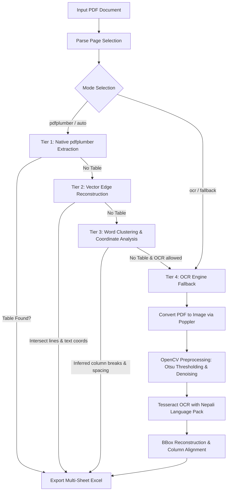

# PDF to Excel (Nepali-Friendly Table Extraction)

[](https://www.python.org/downloads/)
[](LICENSE)
[-green.svg)](https://github.com/tesseract-ocr/tesseract)
[](Dockerfile)
[]()

A robust, multi-tier pipeline to extract tabular data from complex and scanned PDFs—with specialized support for Nepali (`nep`) Devanagari script—and convert them into multi-sheet Microsoft Excel (`.xlsx`) workbooks. It combines native PDF vector extraction with an intelligent Tesseract OCR fallback and edge-detection heuristics.

---

## 🏗️ Architecture & How It Works

Extracting tables from PDFs often fails when documents are scanned, lack clear cell borders, or contain complex scripts like Devanagari. **PDF to Excel** solves this by implementing a 4-tier progressive fallback engine:



### The 4 Extraction Tiers
1. **Tier 1 (pdfplumber)**: Direct vector table parsing from digitally generated PDFs.
2. **Tier 2 (Vector Edge Reconstruction)**: Intersects explicit horizontal and vertical vector rules with text characters to rebuild stripped tables.
3. **Tier 3 (Word Coordinate Clustering)**: Calculates whitespace gaps and word bounding boxes to reconstruct semi-structured, borderless tables.
4. **Tier 4 (OCR Fallback with Tesseract & OpenCV)**: Rasterises pages at 300+ DPI, applies Otsu binarisation, and extracts text using Tesseract's `nep` language model with bounding-box cell alignment.

---

## 📋 Prerequisites & Installation

### Option A: Containerized Setup (Docker - Recommended)

Docker eliminates the need to manually configure Tesseract, Poppler, or language packs on your host system.

```bash
# 1. Clone the repository
git clone https://github.com/ajaymahato431/PDF-to-Excel.git
cd PDF-to-Excel

# 2. Build the Docker image
docker build -t pdf-to-excel .

# 3. Run conversion (mounting current directory for files)
docker run --rm -v "${PWD}:/app/data" pdf-to-excel /app/data/sample.pdf -o /app/data/output.xlsx --mode auto
```

---

### Option B: Native Local Installation

#### 1. System Dependencies (Tesseract & Poppler)

- **Ubuntu / Debian**:
  ```bash
  sudo apt-get update
  sudo apt-get install -y tesseract-ocr tesseract-ocr-nep poppler-utils
  ```

- **macOS (via Homebrew)**:
  ```bash
  brew install tesseract tesseract-lang poppler
  ```

- **Windows**:
  - **Tesseract OCR**: Download and install from [UB-Mannheim Tesseract](https://github.com/UB-Mannheim/tesseract/wiki). Make sure to select **Nepali** in "Additional script data" during setup.
  - **Poppler**: Download the latest release from [Poppler for Windows](https://github.com/oschwartz10612/poppler-windows/releases) and extract to `C:\Program Files\poppler` or add its `bin` directory to your system `PATH`.

#### 2. Python Environment Setup

```bash
# Clone the repository
git clone https://github.com/ajaymahato431/PDF-to-Excel.git
cd PDF-to-Excel

# Create and activate virtual environment
python -m venv venv

# On Linux / macOS:
source venv/bin/activate
# On Windows PowerShell:
.\venv\Scripts\Activate.ps1

# Install required Python packages
pip install -r requirements.txt
```

---

## ⚙️ Configuration Guide

The application supports configuration via a `.env` file, environment variables, or CLI arguments.

1. **Copy the example environment file**:
   ```bash
   cp .env.example .env
   ```

2. **Adjust paths in `.env` (optional)**:
   If Tesseract or Poppler are not in your default system `PATH`, configure them:
   ```env
   # Path to Tesseract binary (if not on PATH)
   TESSERACT_CMD=C:\Program Files\Tesseract-OCR\tesseract.exe

   # Tesseract language data directory
   TESSDATA_PREFIX=C:\Program Files\Tesseract-OCR\tessdata

   # Poppler binaries directory
   POPPLER_PATH=C:\Program Files\poppler\Library\bin

   # Default OCR language
   OCR_LANG=nep
   ```

> **Configuration Precedence**:
> `CLI Arguments` > `Environment Variables (.env)` > `System / Platform Defaults`

---

## 🚀 Usage & CLI Reference

### Basic Command
```bash
python pdf_to_excel.py "input.pdf"
```

### Full Options & Arguments

| CLI Argument | Environment Variable | Default Value | Description |
| :--- | :--- | :--- | :--- |
| `pdf_path` | — | *(Required)* | Path to the input PDF file. |
| `--mode` | `EXTRACTION_MODE` | `prompt` | Strategy: `prompt` (interactive), `auto` (plumber → OCR), `pdfplumber`, `ocr`. |
| `-o`, `--output` | `DEFAULT_OUTPUT` | `extracted_table.xlsx` | Path to the output Excel workbook. |
| `--pages` | — | `None` (all) | Page range, e.g. `"1,3-5"` (1-based index). |
| `--column-breaks` | — | `None` (inferred) | Explicit x-coordinate column breaks (e.g. `--column-breaks 120 260 430`). |
| `--ocr-lang` | `OCR_LANG` | `nep` | Tesseract language code (`nep`, `eng`, `nep+eng`). |
| `--ocr-psm` | `OCR_PSM` | `6` | Tesseract Page Segmentation Mode (6 = single uniform block). |
| `--ocr-confidence`| `OCR_CONFIDENCE`| `70` | Minimum confidence score (0–100) to keep OCR recognized words. |
| `--dpi` | `OCR_DPI` | `300` | PDF rendering DPI before OCR (use 400 for low-res scans). |
| `--force-ocr` | — | `False` | Skip direct extraction and go straight to OCR. |
| `--max-columns` | `MAX_COLUMNS` | `12` | Maximum detected columns before a table is discarded as noise. |
| `--poppler-path` | `POPPLER_PATH` | *(Auto-detected)* | Path to directory containing Poppler binaries (`pdftoppm`). |
| `--tesseract-cmd`| `TESSERACT_CMD`| *(Auto-detected)* | Path to Tesseract executable. |
| `--tessdata-dir` | `TESSDATA_PREFIX` | *(Auto-detected)* | Directory containing Tesseract `.traineddata` files. |
| `--verbose` | `LOG_LEVEL=DEBUG` | `False` | Enable debug logging output. |

---

### Real-World Examples

#### 1. Automatic Hybrid Mode (Direct Text with OCR Fallback)
```bash
python pdf_to_excel.py "documents/annual_report.pdf" --mode auto -o "output/annual_report.xlsx"
```

#### 2. Scanned Document: Force Nepali OCR with High DPI
```bash
python pdf_to_excel.py "scanned_doc.pdf" --mode ocr --dpi 400 --ocr-confidence 65 -o "output/scanned_tables.xlsx"
```

#### 3. Specific Pages with Custom Column Separators
```bash
python pdf_to_excel.py "budget.pdf" --pages "2-4,7" --column-breaks 140 280 460 -o "output/budget.xlsx"
```

#### 4. Headless Execution with Environment Configuration
```bash
# Set environment variables for non-interactive workflows
export EXTRACTION_MODE=auto
export OCR_LANG=nep
python pdf_to_excel.py "input.pdf" -o "output.xlsx"
```

---

## 🔧 Troubleshooting & FAQ

### Q: `Tesseract binary not found`
- **Fix**: Ensure Tesseract is installed. If it is in a custom path, add it to your system `PATH` or set `TESSERACT_CMD` in `.env`:
  ```env
  TESSERACT_CMD=/usr/bin/tesseract
  ```

### Q: `Error opening data file .../nep.traineddata`
- **Fix**: The Nepali language pack is missing.
  - Linux: `sudo apt-get install tesseract-ocr-nep`
  - macOS: `brew install tesseract-lang`
  - Windows: Download `nep.traineddata` from the [Tesseract GitHub Tessdata repository](https://github.com/tesseract-ocr/tessdata) and place it in your `tessdata` folder. Set `TESSDATA_PREFIX` to that folder.

### Q: `PDFInfoNotInstalledError: Unable to get page count. Is poppler installed and in PATH?`
- **Fix**: `pdf2image` requires Poppler. Ensure `pdftoppm` is on your PATH or set `POPPLER_PATH` in `.env`.

### Q: Table columns are misaligned or merged in OCR mode
- **Fix**:
  1. Increase rendering resolution: `--dpi 400`
  2. Provide explicit column separators: `--column-breaks 100 250 500`
  3. Adjust horizontal grouping gap: `--min-gap 12.0`

---

## 📄 License

This project is licensed under the **MIT License**. See the [LICENSE](LICENSE) file for details.
